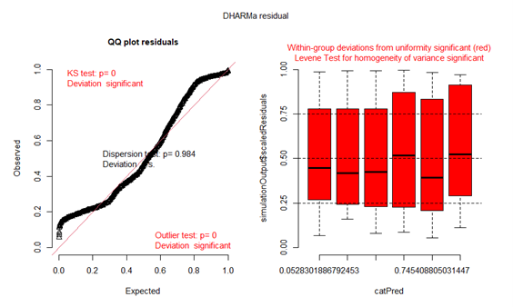

```{r setup, include=FALSE}
knitr::opts_chunk$set(echo = TRUE)
```

Import library
```{r, warning=FALSE, results="hide", message=FALSE}
library(tidyverse)
library(readr)
library(hms)
library(nlme)
library(lme4)
library(DHARMa)
library(MASS)
```

# Data analysis on Straw-headed Bulbul

## Data cleaning & Importing

Fieldwork for data collection and code for data cleaning were all kindly provided by Shuna Maekawa.
```{r}
# Identifying public holidays within the period of data collection
public_holidays <- as.Date(c("2022-12-31", "2023-01-01","2023-01-02", "2023-01-03", "2023-01-27", "2023-01-28", "2023-01-29", "2023-01-30", "2023-01-31", "2023-02-10", "2023-02-13", "2023-03-01"))

prep_data <- function(df){
  df |>
    mutate(
      transect = as.double(substr(FOLDER, 2,2)),
      distance = case_when(
        substr(FOLDER, 4, 4) == "5" ~ 50,
        substr(FOLDER, 4, 4) == "1" ~ 100,
        TRUE ~ 200
        ),
      time_sec = as.numeric(TIME) + OFFSET,
      time_day = as_hms(time_sec),
      to_classify = weekdays(DATE),
      Date = as.Date(DATE, format = "%m/%d/%Y"),
      days = case_when(
        Date %in% public_holidays ~ "off_day", 
        to_classify == "Saturday" ~ "off_day",
        to_classify == "Sunday" ~ "off_day",
        TRUE ~ "weekday") # categorizing weekends and public holidays as off days as less traffic and lower noise pollution is expected then
    ) |>
    dplyr::select(
      DATE, top_match = `TOP1MATCH*`, top_dist = TOP1DIST,
      transect, distance, time_day, days, DURATION
    )
}

# Importing data for Bulbul birds
BB <- prep_data(read_csv("data/BB_clusters.csv"))
```

Next, we filter out data on non Straw-headed Bulbul as well as data collected from transect 2 due to its discrepancy in lay-out compared to other transects. Additionally, to account for 75% precision rate, a threshold of 0.917 is implemented.
```{r}
BB_analysis <- BB |>
  ## filter for the top_match
  filter(top_match == "Straw-headed Bulbul",
         !transect %in% c(2)) |> # removing transect 2
  filter(top_dist <= 0.917) # implementing threshold

BB_analysis <- BB_analysis |>
  mutate(
    days = as.factor(days),
    transect = as.factor(transect)
  ) 
```

## Duration of Birdsong
### Data exploration
Our variables are as follows:

- Independent variable
  - Distance from BKE (continuous)
  - Type of days: Weekdays vs. Weekends (categorical)

- Dependent variable
  - Duration of call (continuous)

- Random effect
  - Transect
  
To have a baseline understanding of our data, we plotted a boxplot to better understand the relationships between the aforementioned variables. 
```{r, fig.width=6, fig.height=4}
BB_analysis |>
  ggplot(aes(x = days, y = DURATION, color = as.factor(distance))) +
  geom_boxplot() +
  labs(x = NULL,
       y = "Duration of Birdsong (secs)",
       color = "Distance (m)") +
  theme_classic() +
  scale_x_discrete(
    labels = c("Off days", "Weekdays")
  )
```

For both off days and weekdays, birdsong call duration decreases as distance from BKE increases.

### Duration analysis

#### Linear mixed-effect model
Given these variables, we ran a linear mixed-effect model and carried out diagnostic plots to examine the violation of assumptions
```{r, fig.width=6, fig.height=4}
BB_duration_model <- lme(DURATION ~ distance * days, random = ~1|transect, data = BB_analysis)
summary(BB_duration_model)

# variance for the dataset 
# Whole dataset
plot(BB_duration_model)
# By transect
plot(BB_duration_model, resid(.,scaled = T) ~ fitted(.) | transect, abline = 0, lty = 2)
# a pattern of residuals decreasing as fitted values increase is observed

# Normality 
qqnorm(BB_duration_model, abline = c(0, 1), lty = 2)
qqnorm(BB_duration_model, ~resid(., type = "p") | transect , abline = c(0,1) , lty = 2)
# assumption of normal distribution is violated
```


We observe that the assumptions of homoscedasticity and normality of dataset are violated. After transforming of data failed to resolve these violations, we carried out the analysis using Negative Binomial generalized linear mixed-model.

#### Negative binomial generalized linear mixed-model

The model takes forever to run, but in the end it gives us the warning and tells us to rescale the variable.
```{r, fig.width=6, fig.height=6, warning=FALSE}
# BB_duration_model.1 <- glmer.nb(DURATION ~ distance * days + (1|transect), data = BB_analysis)
# summary(BB_duration_model.1)
# plot(simulateResiduals(BB_duration_model.1))
```


#### Negative binomial generalized linear mixed-model with distance rescaled

Similarly, for the sake of compilation, I will not be running this model in this file.
```{r, fig.width=7, fig.height=6, warning=FALSE}
# BB_duration_model.2 <- glmer.nb(DURATION ~ scale(distance) * days + (1|transect), data = BB_analysis)
# summary(BB_duration_model.2)
```


We then ran diagnostic plots to examine the presence of violation of assumptions in the model:



Again, we observe that the assumptions of homoscedasticity and normality of dataset are still violated. We thus carried out the analysis using generalized linear mixed-model with quasi-distribution. 

#### Generalized linear mixed-model with quasi-distribution
```{r, fig.width=7, fig.height=6, warning=FALSE}
BB_duration_model.3 <- glmmPQL(DURATION ~ distance * days, random = ~1|transect, data = BB_analysis, family = quasi)
summary(BB_duration_model.3)
```

Here, violations of assumptions do not need to be assessed. This model indicates that the interaction between distance and type of day is not statistically significant with a p-value of 0.943 (3 s.f.), of which is greater than 0.05. To achieve a minimum adequate model, we remove this interaction and generated the model below:
```{r, fig.width=7, fig.height=6, warning=FALSE}
BB_duration_model.4 <- glmmPQL(DURATION ~ distance + days, random = ~1|transect, data = BB_analysis, family = quasi)
summary(BB_duration_model.4)
```
This is the minimum adequate model as all variables are statistically significant. From the model, we can conclude that:

1. On weekdays, duration increases by 0.327s.

2. For each 1m increase in distance from BKE, duration decreases by 0.003056s.

## Dawn chorus analysis

Data cleaning to record the birdsong vocalisations between 6-10am.
```{r, warning=FALSE, message=FALSE}
BB_chorus <- BB_analysis |>
  filter(time_day <= as.hms("10:00:00", format = "%h%m:%s"))  |>
  group_by(transect, distance, days) |>
  summarise(n = n()) 
```

### Data exploration
Our variables are as follows:

- Independent variable
  - Distance from BKE (continuous)
  - Type of days: Weekdays vs. Weekends (categorical)

- Dependent variable
  - Number of vocalizations (count)

- Random effect
  - Transect
  
To have a baseline understanding of our data, we plotted a boxplot to better understand the relationships between the aforementioned variables. 
```{r, fig.width=5, fig.height=4}
BB_chorus |>
  ggplot(aes(x = days, y = n, color = as.factor(distance))) +
  geom_boxplot() +
  labs(x = NULL,
       y = "Number of Vocalizations",
       color = "Distance (m)") +
  theme_classic() +
  scale_x_discrete(labels = c("Off days", "Weekdays"))
```
Here, we observe that for the type of days, there is a difference in the relationship between number of birdsong occurrences and distance from BKE, where there is a positive relationship between 50-100m and a negative relationship between 100-200m. As such, we will be carrying out a piecewise regression.
\n

Functions for the implementation of piecewise regression.
```{r}
bp <- 100
# 50 - 100
b1 <- function(x, bp) ifelse(x <= bp, x, 0)
# 100 - 200
b2 <- function(x, bp) ifelse(x < bp, 0, x)
```

#### Generalized linear mixed-model with poisson distribution
Given these variables, we ran a generalized linear mixed model and carried out diagnostic plots to examine the violation of assumptions.
```{r, fig.width=7, fig.height=6}
BB_chorus_model.1 <- glmer(n ~ b1(distance, 100) * days + b2(distance, 100) * days + (1|transect), 
                         data = BB_chorus, family = poisson)
```
This model suggests for distance to be rescaled.

#### Generalized linear mixed-model with poisson distribution and distance rescaled
```{r, fig.width=6, fig.height=4}
BB_chorus_model.2 <- glmer(n ~ scale(b1(distance, 100)) * days + scale(b2(distance, 100)) * days + (1|transect), data = BB_chorus, family = poisson)
plot(simulateResiduals(BB_chorus_model.2))
summary(BB_chorus_model.2)
```
The model shows that there is no violation of assumptions. This model indicates that the interaction between distance and type of day is not statistically significant with p-values greater than 0.05. To achieve a minimum adequate model, we remove this interaction and generated the model below:
```{r, fig.width=7, fig.height=4}
BB_chorus_model.3 <- glmer(n ~ scale(b1(distance, 100)) + scale(b2(distance, 100)) + days + (1|transect), data = BB_chorus, family = poisson)
summary(BB_chorus_model.3)
plot(simulateResiduals(BB_chorus_model.3))
```
This is the minimum adequate model as all variables are statistically significant. 

#### Interpretation
```{r}
# 50-100m
exp(0.09562) - 1

# 100-200m
1 - exp(0.15490)

# Type of day
exp(0.50265)
```
From the model, we can conclude that:

1. Between 50-100m, for every one unit increase in scaled distance from BKE, no. of vocalisations increases by 10.0% (3 s.f.)

2. Between 100-200m, for every one unit increase in scaled distance from BKE, no. of vocalisations decreases by 16.8% (3 s.f.)

3. On weekdays, the number of calls is 1.65 times greater than the number of calls on weekends


To interpret the scaled distance:
\
50 - 100m:
```{r}
sd(b1(BB_chorus$distance, 100))
```
For 50 - 100m, 1 unit of scaled distance is 42.6m (3 s.f.).
\
100 - 200m:
```{r}
sd(b2(BB_chorus$distance, 100))
```
For 100-200m, 1 unit of scaled distance is 82.5m (3 s.f.).

Therefore, the three takeaways from this analysis is that:

1. Between 50-100m, for each 42.6m distance away from BKE, no. of vocalisations increases by 10.0% (3 s.f.)

2. Between 100-200m, for each 82.5m distance away from BKE, no. of vocalisations decreases by 16.8% (3 s.f.)

3. On weekdays, the number of calls is 1.65 times greater than the number of calls on weekends


